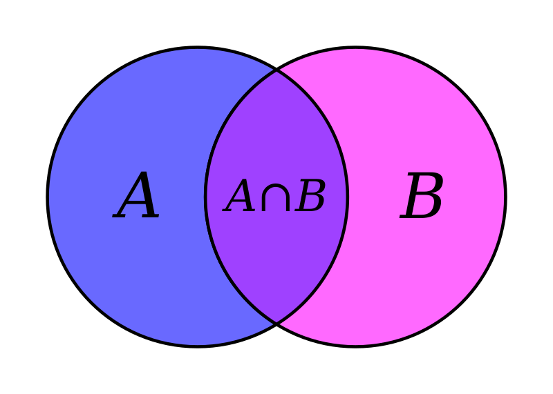
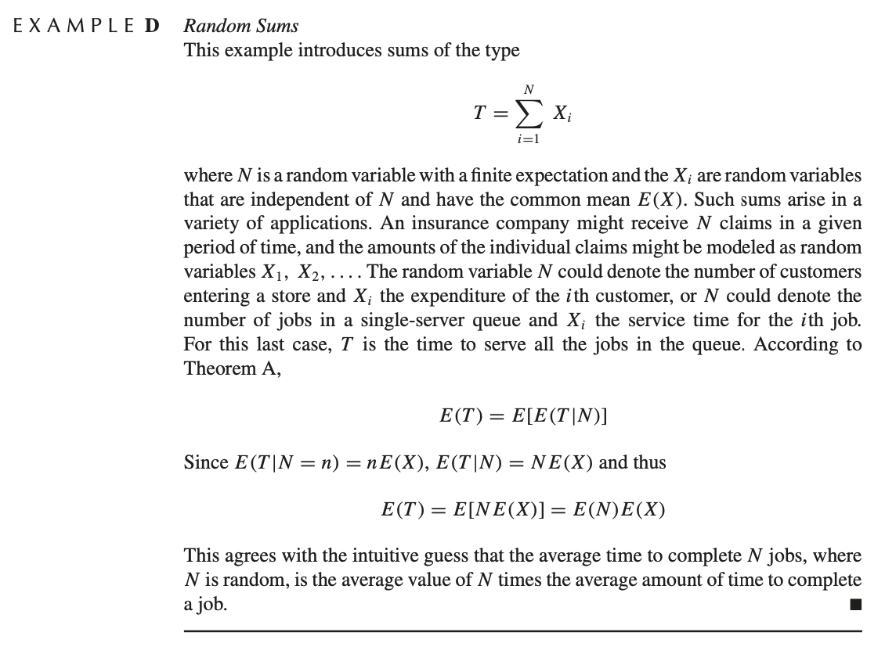
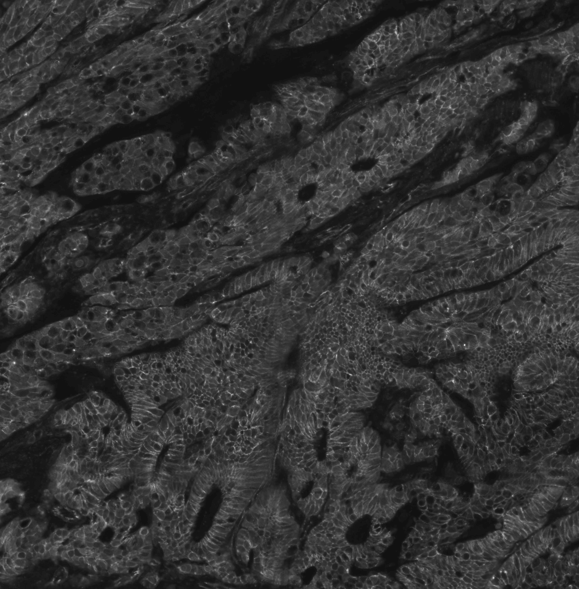

# Probability

## Probability review

### Objectives

In this meeting we will:

* Introductions
* Review some probability notation (e.g. PMF, Expectations)
* Use Bernoulli random variables to study proportions
* Define Estimators and learn to compute values assess estimators


### Administrative stuff

1. Introductions
    + How did you get interested in statistics?
    + What do you do for fun?
2. Syllabus


### Types of data


* Continuous
* Categorical
* Ordinal


Examples:

* Brain volume
* Diagnosis
* Symptom rating scale (1-7)
* Coin flip
* Proportion of heads in $N$ flips
* Proportion of time spent sleeping each week


### Random variables

Random variables are the key player in statistics and are often used to describe the process by which data arise.


#### Probability notation

* Blackboard P is probability, $\mathbb{P}(X=x)$, means the probability the random variable $X$ is equal to the nonrandom value $x$.
* $\sim$ "is distributed as"
* Probability mass function (PMF; loose definition is it assigns probabilities to values for a given random variable)
* Continuous/Discrete random variables
* A random variable does not have a value in itself... We don't usually talk about $X=0.5$, but $\mathbb{P}(X=0.5)$.


#####	Bernoulli example

* Something that takes only two values can be described with a Bernoulli random variable.
  + Coin flip
  + Diagnosis
* For $X\sim \text{Be}(\pi)$: X is distributed as [Bernoulli](https://en.wikipedia.org/wiki/Bernoulli_distribution), with parameter $\pi \in (0,1)$, e.g. $\pi=0.25$.
* $\P(X = x) = \pi^x(1-\pi)^{(1-x)}$. That is the probability mass function (PMF) of a Bernoulli random variable
* Common notation is $f_X(x)$ is the PMF of the random variable $X$. In this case $f_X(x):=\pi^x(1-\pi)^{(1-x)}$.
* $:=$ notation means "is defined by."


#### Probability axioms

We have an intuitive understanding of the basic axioms of probability.

* An event $E$ is something that can occur, e.g. head or tails $\{0,1\}$.
* Let $\Omega = {0,1}$ be union of all possible events

The (Kolmogorov) axioms are

1. $\P(X\in E) \ge 0$ -- probability is positive.
2. $\P(X\in \Omega) = 1$ -- probabilities sum to 1. 
3. For disjoint sets $E_1 \cap E_2 = \varnothing$, $\P(E_1 \cup E_2) = \P(E_1) + \P(E_2)$.


#### Why use probabilities for data?

STOPPED HERE

* Intuitive and communicable explanation?
* Table below from [Chess in the air](https://chessintheair.com/the-risk-of-dying-doing-what-we-love/)


<center>
{#id .class width=75%}

#### Multinomial example

* A die is an example of a multinomial distribution

```{r}
die = data.frame('X'=1:6, 'P(X)'=paste0('$\\pi_', 1:6, '$'), check.names = FALSE)
knitr::kable(die)
```

* Can also think about statements like $\P(X\le x)$
* This is a sum over probabilities corresponding to possible values of $X$.
* Missing probabilities are called parameters

e.g. x = 2
\[
\sum_{i=1}^2 \P(X=i) = 1/3
\]

#### Wordle Multinomial example

* Multinomial can be used for distributions of other things
* E.g. Wordle scores. The probability of getting the Wordle in a certain number of guesses.
* Also 6 (or one more) possible values.
* Same family of distribution as the die, except with different *parameters*

$Y=$Number of tries | $P(Y)$  |
|-------|:----:|
| 1 | 0 |
| 2 | 0.03 |
| 3 | 0.28 |
| 4 | 0.40 |
| 5 | 0.18 |
| 6 | 0.11  |
| 7 | ?? |

```{r}
wordle = c(0, 2, 17, 25, 11, 7)
#wordle/sum(wordle)
#round(wordle/sum(wordle), 2)
```


<center>
{#id .class width=25%}

#### Normal example

* The normal density has two parameters $\mu, \sigma$ is
\[
\P(X\le x) = \int_{-\infty}^x (2\pi\sigma^2)^{-1/2} \exp\left\{-\frac{1}{2\sigma^2}(z-\mu)^2 \right\}dz
\]

* Probabilities of sets $\P(X \in E)$, where $E = (-\infty, -1.96) \cup (1.96, \infty)$.
* Probability $X=x$?

<!-- #### Properties of probabilities -->
<!-- The Kolmogorov axioms describe the rules probability has to follow. Informally, they are -->

<!-- 1. $\P(X \in E) \ge 0$ -->
<!-- 2. If $E$ is the whole domain of $X$, then $\P(X\in E) = 1$ -->
<!-- 3. For a bunch of sets that are disjoint $E_1, \ldots, E_K$, then $\P\left(X\in \bigcup_{k=1}^K E_k\right) = \sum_{k=1}^K \P(X \in E_k)$ -->

Examples:

2. Multinomial -- after a rolling a die, it has to land on one of them. Normal, $E=(-\infty,\infty)$.
3. If not disjoint, then adding some probabilities twice. Multinomial $\{1,2,3 \}, \{4,3\}$


## CDFs, PDFs, quantile functions


### Objectives

* Introduce CDFs, PDFs, and quantile functions
* Introduce Expectations (means)


### PDFs and CDFs (and quantile functions)


#### CDFs
The cumulative distribution function (CDF), $F(x)$, for a random variable $X$ is a function that satisfies
\[
F(x) = \mathbb{P}(X \le x).
\]
They are usually functions of parameters. Here are some examples.

```{r, echo=FALSE, eval=TRUE, fig.cap='Some distribution functions.', fig.width=10}
# Example CDFs (Cumulative distribution functions/Distribution functions)
# F(x) = P(X<=x) \in [0,1]
# properties: nonegative increasing function, F(-\infty) = 0, F(\infty)=1
# Multivariate version "Distribution" function
# Normal
# Gamma
# Poisson

layout(matrix(1:4, nrow=1))
x = seq(-3, 3, length.out=1000)
plot(x, pnorm(x), type='l', main='Normal(0,1)', ylab='P(X<=x)')
x = seq(-1, 10, length.out=1000)
plot(x, pgamma(x, shape=1, rate=1/2), type='l', main='Gamma(1,1/2)', ylab='P(X<=x)')
x = seq(-1, 15, length.out=1000)
plot(x, ppois(x, lambda=5), main='Poisson(5)', type='s', ylab='P(X<=x)')
x = seq(-1, 2, length.out=1000)
plot(x, pbinom(x, size = 1, prob = 1/4), main='Bern(1/4)', type='s', ylab='P(X<=x)')
```


For discrete random variables the derivative of the CDF does not exist because it is a step function, but the probability mass function is the amount the CDF jumps up at that location, heuristically we can define it as
\[
f(x) = F(x+\Delta x) - F(x),
\]
for an infinitesimal value $\Delta x$.


##### Wordle CDF example

$Y=$Number of tries | $P(Y|\text{Simon})$  |  $P(Y|\text{Lillie})$ |
|-------|:----:|:----:|
| 1 | 0 | 0 
| 2 | 0.03 | 0.05
| 3 | 0.28 | 0.24
| 4 | 0.40 | 0.44
| 5 | 0.18 | 0.19
| 6 | 0.11  | 0.08

```{r}
wordle1 = c(0, 2, 17, 25, 11, 7)
wordle2 = c(0, 2, 9, 16, 7, 3)
wordle1 = cumsum(wordle1/sum(wordle1))
wordle2 = cumsum(wordle2/sum(wordle2))
x = 0:7
plot(x, c(0,wordle1, 1), main='Wordle CDFs', type='s', ylab='P(X<=x)')
points(x, c(0,wordle2, 1), type='s', col='red')
```


<center>
{#id .class width=25%}
{#id .class width=25%}
</center>


#### PDFs
The PDF (probability density function) is the derivative of the CDF and often denoted with a lower case letter $f(x)$.
For discrete random variables the PDF is call the PMF (probability mass function).

```{r, echo=FALSE, fig.cap='Corresponding density functions.', fig.width=10}
layout(matrix(1:4, nrow=1))
x = seq(-3, 3, length.out=1000)
plot(x, dnorm(x), type='l', main='Normal(0,1)', ylab='P(X=x)')
x = seq(0, 10, length.out=1000)
plot(x, dgamma(x, shape=1, rate=1/2), type='l', main='Gamma(1,1/2)', ylab='P(X=x)')
x = seq(0, 15)
plot(x, dpois(x, lambda=5), main='Poisson(5)', type='p', ylab='P(X=x)')
x = seq(0, 1)
plot(x, dbinom(x, size = 1, prob = 1/4), main='Bern(1/4)', type='p', ylab='P(X=x)', ylim=c(0,1))
```

#### PDFs continued {.flexbox .vcenter}
The PDF can conceptually be thought of as $\mathbb{P}(X=x)$, for PMFs, that's exactly what it is. But, for continuous random variables the probability they take any value is equal to zero.
These CDFs and PDFs are functions with parameters:
\[
\begin{align*}
\text{Normal: }& f(x; \mu, \sigma^2) = (2\pi\sigma^2)^{-1/2} \exp\left\{-\frac{1}{2\sigma^2}(x-\mu)^2 \right\} \\
\text{Gamma: }& f(x; \alpha, \beta)  =  \frac{\beta^\alpha}{\Gamma(\alpha)} x^{\alpha-1} e^{-\beta x} \\
\text{Poisson: }& f(x; \lambda)  =  \frac{\lambda^k\ e^{-\lambda}}{k!} \\
\end{align*}
\]

The CDF and PDF are useful because we never know what values the random variable will take, so we can integrate the PDF or use the CDF to figure out where they are most likely to fall.


#### Quantile functions {.flexbox .vcenter}

The quantile function is the inverse of the CDF.

* For a given probability $p$, it spits out a value $Q(p)$ such that that $F(Q(p)) = p$.
* The interpretation is that for a given probability $p$, There's a $p$ percent probability that the random variable will be below $Q(p)$.
* Sometimes, it's possible to find the quantile function explicitly, but many times it isn't.


### Expectations

#### Overview
Many things we care about about a random variable are expectations.
The expectation is an "operator" on a random variable, meaning it takes function of a random variable $g(X)$ for a (somewhat) arbitrary function $g$ and is defined by
\[
\mathbb{E} g(X) = \int_{\mathcal{X}} g(x) p(x) dx,
\]
where $p(x)$ is the density function of $X$ and the $\mathcal{X}$ subscript is to denote that we are integrating over the domain of values $X$ can take.


#### Great expectations
The mean is the most common expectation
\[
\mathbb{E} X = \int_{\mathcal{X}} x p(x) dx.
\]

* The integral notation is in the sense of "real analysis" type integrals that can refer to sums or integrals. This is to emphasize that the definition is the same with continuous or discrete random variables.

Another great expectation is the variance
\[
\text{Var}(X) = \mathbb{E} (X - \E X)^2 = \E X^2 - (\E X)^2
\]
Properties of the variance are homework questions.

In general,
\[
\E X^k
\]
is call the $k$th moment of $X$.

#### Properties of expectations

* $\E a X + b = a \E X + b$
* $\E\{ \E X\} = \E X$ ($\E X$ is a constant)


####	Expected value for Bernoulli


* For the Bernoulli $X\sim \text{Be}(p)$ the expectation is
\[
\E X = \sum_{i=0}^1 x_i f_X(x_i) = 1 \times p + 0 \times (1-p) = p
\]

#### Expected value for Multinomial

$Y$ | $P(Y)$  | $P(Y)$  | $P(Y)$  |
|-------|:----:|:----:|:----:|
| 1 | 1/4         | .1 |  .7      |
| 2 | 1/4      | .2  | .1     |
| 3 | 1/4      | .3  | .1       |
| 4 | 1/4      | .4  | .1       |


#### Expected value for Wordle score

$Y=$Number of tries | $P(Y)$  |
|-------|:----:|
| 1 | 0 |
| 2 | 0.03 |
| 3 | 0.28 |
| 4 | 0.40 |
| 5 | 0.18 |
| 6 | 0.11  |

```{r}
wordle = c(0, 2, 17, 25, 11, 7)
#wordle/sum(wordle)
#round(wordle/sum(wordle), 2)
```


<center>
{#id .class width=25%}
</center> 


#### Expected value for Poisson random variable

* Poisson random variables are useful for modeling skewed counts.
* E.g. number of drinks of alcohol in a week.
* E.g. score on a depression inventory or other psychology/scale.

\[
f(x; \lambda)  =  \frac{\lambda^x\ e^{-\lambda}}{x!}
\]

* Expectation and Variance of Poisson distribution

```{r, fig.width=5, fig.height=5}
x = seq(0, 15)
plot(x, dpois(x, lambda=5), main='Poisson(5)/Poisson(0.5)', type='p', ylab='P(X=x)', ylim=c(0,1))
points(x, dpois(x, lambda=0.5), type='p', col='red')
```


#### Expected value for standard Normal distribution

Start with the standardized normal distribution
\begin{align*}
 \E X & = \int_{-\infty}^\infty x \left(2\pi \right)^{-1/2} \exp\left\{-\frac{1}{2} x^2 \right\}\\
 & = \left(2\pi \right)^{-1/2} \int_{0}^\infty \exp\{-u\} du - \left(2\pi \right)^{-1/2} \int_{0}^\infty \exp\{-u\} du
\end{align*}
where $u = x^2/2$.

* This equals zero.


#### Expected value for Normal distribution

Start with the standardized normal distribution and use change of variables.

* For $X\sim N(0,1)$, let $Y = X\sigma + \mu$.
* What is $\E Y$?
* Then $\P(Y<z) = \P((X\sigma+\mu)<z) = \P(X< (z - \mu)/\sigma) = \int_{-\infty}^{(z-\mu)/\sigma} \left(2\pi \right)^{-1/2} \exp\left\{-\frac{1}{2} x^2 \right\} dx= \int_{-\infty}^{y} \left(2\pi \sigma^2\right)^{-1/2} \exp\left\{-\frac{1}{2\sigma^2} (w-\mu)^2 \right\} dw$
* This is the CDF a $N(\mu, \sigma^2)$.

#### Properties of variance

* $\Var(aX +b) = a^2 \Var(X)$


## Multivariate random variables


#### Overview

Let $W = (X, Y) \in \mathcal{B}$ be a multivariate random variable.
$X$ and $Y$ can be continuous or discrete.
For example $X,Y$ can be multivariate normal.

#### Example
For $X\in\{1,2\}$ and $Y \in \{1,2,3\}$ 

* Joint probability table
* Marginal probabilities
* Conditional probabilities (intuitively)

Draw the 3 different tables.

```{r, results='asis'}
probs = data.frame( X=rep(1:3, each=2), Y = rep(c(1,2), 3))
probs$p = paste0('$p_{', probs$X, probs$Y, '}$')
tabout = t(table(probs$X, probs$Y))
tabout[,] = probs$p
tabout = t(tabout)
knitr::kable(tabout, row.names = TRUE, escape = FALSE )
```


#### Example: Umbrella and raining

* A common example is whether someone brings an umbrella with them


| | It's not raining | It's raining  |
|-------|:----:|:----:|
I don't bring umbrella | 0.05 | 0.17 |
I bring umbrella | 0.35 | 0.43 |

Another example

| | It's not precipitating | It's raining  | It's snowing |
|-------|:----:|:----:|:----:|
I don't bring umbrella | 0.05 | 0.17 | 0.02 |
I bring umbrella | 0.35 | 0.40 | 0.03 |


### Distribution functions

The distribution function for multivariate random variables is often written in terms of subsets $B \subset \mathcal{B}$
\[
F_W(B) = \P(W \in B).
\]

If $W$ has a density then we can also write for values $x$ and $y$ (in the appropriate domain)
\[
\P(W \in B) = \int_{\mathcal{B}} f_W(x, y)dx dy,
\]
where $f_W$ is the PDF or PMF of $W = (X,Y)$.

### Marginal probability

* The marginal probability, $\P(Y=y)$ is the probability for $Y$ ignoring whatever is going on with $X$.
* This can be found by integrating out the $X$ variable.
\[
f_Y(y) = \int_\mathcal{X} f_{X,Y}(x, y)dx
\]
* Joint multinomial above to demonstrate this.


### Conditional distribution

Conditional distributions can be written in terms of the underlying probability space. For sets $A, B \subset \mathcal{B}$
\[
\P(A \mid B ) = \frac{\P( A \cap B)}{\P(B)}
\]
<center>
{#id .class width=25% height=25%}
</center>

Conceptually, the denominator adjusts the numerator for the fact that we are only considering events that include B occurring. This makes the conditional probabilities sum to 1.

For multivariate random variables the definition is similar
\[
\P(Y=y \mid X=x) = \frac{\P(X=x, Y=y)}{\P(X=x)}
\]

* Can think of the Venn diagram in terms of the joint random variable falling into the set.
* Probability I bring and umbrella given that it's raining
* Probability it's raining given it's not precipitating (Conditioning on itself)


### Examples

#### Insurance dataset children and region
* In the insurance dataset, we can consider the probability of having a certain number of children living in a certain area.

```{r}
library(RESI) # contains insurance dataset
childByRegion = table(insurance$region, insurance$children)
childByRegion = childByRegion/sum(childByRegion)
knitr::kable(round(childByRegion, 2))
```

* Let $X$ be a random variable denoting number of children
  + Is it categorical/continuous/ordinal?
* Let $Y$ be a random variable denoting region
  + Is it categorical/continuous/ordinal?
* joint distribution is a function of both variables $\mathbb{P}(X=x, Y=y) = f(x,y)$.

* Questions about regional differences and number of children can be determined from the table
* What is the probability of having zero kids and living in the east?
* What is the probability of having zero kids?


#### Insurance data multivariate distribution of age and charges

```{r, fig.width=2.5}
library(RESI)
name='charges'
hist(insurance[,name], xlab=name, main=name, freq=FALSE)
lines(density(insurance[,name], adjust=1.5), lwd = 2) 
```

* Relationship between age and charges in the insurance data 

```{r, fig.width=2.5}
plot(insurance[,'age'], insurance$charges, ylab='Charges', xlab='Age', main=paste('Age', 'and', 'Charges') )
```

* The scatter plot can be thought of as a dataset version of a joint density $f_{X,Y}(x,y)$
* We can get the conditional histograms for a few different age groups

```{r, fig.width=15, fig.height=5}
par(mar=c(8,2.8,1.8,.2), mgp=c(6,.7,0))
nbin = 15
insCat = with(insurance, data.frame(age=cut(age, breaks = seq(min(age), max(age), length.out=7), include.lowest=T), charges=cut(charges/1000, breaks = seq(min(charges/1000), max(charges/1000), length.out=nbin), include.lowest=T) ) )
condTab = do.call(cbind, by(insCat$charges, insCat$age, function(x){res=table(x); res/sum(res)}))
barplot(condTab, beside=TRUE, col=rep(cols[1:ncol(condTab)], each=nbin-1),
        names.arg = rep(rownames(condTab), ncol(condTab) ), las=2, xlab='Charges (in thousands)', main='Conditional frequencies')
legend('topright', fill=cols[1:ncol(condTab)], legend=colnames(condTab), bty='n')
```


```{r, fig.width=15, fig.height=5}
par(mar=c(8,2.8,1.8,.2), mgp=c(6,.7,0))
nbin = 15
jointTab = do.call(cbind, by(insCat$charges, insCat$age, function(x){res=table(x); res}))
jointTab = jointTab/sum(jointTab)
barplot(jointTab, beside=TRUE, col=rep(cols[1:ncol(jointTab)], each=nbin-1),
        names.arg = rep(rownames(jointTab), ncol(jointTab) ), las=2, xlab='Charges (in thousands)', main='Joint frequencies')
legend('topright', fill=cols[1:ncol(jointTab)], legend=colnames(jointTab), bty='n')
```


```{r, fig.width=15, fig.height=5}
par(mar=c(8,2.8,1.8,.2), mgp=c(6,.7,0))
nbin = 15
test = barplot(t(jointTab), beside=FALSE, col=cols[rep(1:ncol(jointTab), nbin-1)], las=2, xlab='Charges (in thousands)', main='Marginal frequencies', space=0)
legend('topright', fill=cols[1:ncol(jointTab)], legend=colnames(jointTab), bty='n')
```


### Conditional means and variances

* Once you have conditional probabilities, you can do all the same stuff with it that you would do with a regular random variable
* For example, $\mathbb{E}(X \mid Y) = \sum_{x} x f_{X\mid Y}(x \mid y)$

Conditional expectation is just an expectation with respect to a conditional distribution.
\[
\begin{align*}
\E(Y \mid X=x) & = \int_{\mathcal{Y}} yf_{Y\mid X=x}(y\mid x)dy \\
& = \int_{\mathcal{Y}} yf_{Y,X}(y, x)/f(x)dy \\
& = \int_{\mathcal{Y}} yf_{Y,X}(y, X)/f(X)dy
\end{align*}
\]

It can still be thought of as random with respect to the conditioning variable.


| | $P(X=1)=.1$ | $P(X=2) = .7$ | $P(X=3)=.2$ |
|-------|:----:|:----:|:----:|
| $Y$ | $P(Y|X=1)$  | $P(Y| X=2)$  | $P(Y| X=3)$  |
| 1 | 1/4         | .1 |  .7      |
| 2 | 1/4      | .2  | .1     |
| 3 | 1/4      | .3  | .1       |
| 4 | 1/4      | .4  | .1       |


### Properties of expectation for two random variables
Expectation is linear because it is an integral. For example, for constants $a,b$ and random variables $X,Y$
\[
\mathbb{E}(aX + bY) = a \mathbb{E} X + b\mathbb{E}Y
\]
I'll often write it without parentheses (e.g. $\mathbb{E}aX$).

#### Example: discrete and continuous joint distribution

* Diagnosis and hippocampus volume in Alzheimer's disease.
* $P(DX)$ is multinomial, $P(Hipp\mid DX)$ assumed to be normal.

```{r}
adni = readRDS('../datasets/adni/hippocampus.rds')
tab = round(do.call(rbind, by(adni$LEFTHIPPO, adni$DX, function(x) c(mean(x), var(x)) )), 0)
pX = table(adni$DX); pX = as.data.frame(round(pX/sum(pX),2)); names(pX) = c('X', 'P(X)')
colnames(tab) = c('Mean', 'Variance')

knitr::kable(pX, row.names = FALSE, escape = FALSE )
knitr::kable(tab, row.names = TRUE, escape = FALSE )
```


### Independence

* Two random variables are independent if they factor $\mathbb{P}(X=x, Y=y) = \mathbb{P}(X=x)\mathbb{P}(Y=y)$ for all possible values of $x$ and $y$.
* Intuitively, this means that fixing one variable doesn't affect the distribution of the other.
* Another way to express it is that $\mathbb{P}(X=x\mid Y=y) = \mathbb{P}(X=x)$.
* The table is pretty close to independent.

If the table above were perfectly independent, it might look like this:
```{r, fig.width=6}
rs = rowSums(childByRegion)
cs = colSums(childByRegion)
indepTab = outer(rs, cs)
knitr::kable(round(indepTab, 3))

barplot(indepTab, main='Joint probabilities', ylab='Probability', xlab='Number of children', beside=T, col=cols[1:nrow(indepTab)])
legend('topright', fill=cols[1:nrow(indepTab)], legend=rownames(indepTab), bty='n' )

condTab = sweep(indepTab, 1, rowSums(childByRegion), FUN = '/')
barplot(condTab, main='Conditional probabilities', ylab='Probability', xlab='Number of children', beside=T, col=cols[1:nrow(condTab)])
legend('topright', fill=cols[1:nrow(condTab)], legend=rownames(condTab), bty='n' )

```

* This means that **they are independent if their CDFs or PDFs factor**!
* Intuitively, two random variables are independent if the value of one does not affect the probability distribution of the other.
* Mathematically, that implies $\P(X=x \mid Y=y) = \P(X=x)$ (this is a homework question).


### Covariance and dependence

Expand this and derive the other formula
\[
\text{Cov}(X, Y) = \E(X-\E X)(Y-\E Y)
\]

Correlation is
\[
\begin{align*}
\text{Cor}(X,Y) = \frac{\text{Cov}(X,Y)}{\sqrt{\text{Var}(X)\text{Var}(Y)}}
\end{align*}
\]

* Covariance implies dependence, but dependence does not imply covariance (homework question)
* Independence implies zero covariance, but dependence does not imply nonzero covariance

### Properties of variances of sums

Derive the variance of this

* $\text{Var}(X + Y) = \Var(X) + \Var(Y) + 2\text{Cov}(X, Y)$


### Law of total expectation

The law of total expectation is relatively simple, but super handy.
\[
\E \{\E(X \mid Y)\} = \E X
\]
If you are trying to take a mean of a complicated random variable, then you can condition on part of it first and then take the expectation of the part you conditioned on.


* Example: continue from last table
* Example: Use diagnosis and hippocampal volume above


* Example from Rice:

{#id .class width=100% height=60%}


### Law of total variance

The law of total variance states that
\[
\text{Var}(Y) = \E\text{Var}(Y \mid X) + \text{Var}\{ \E(Y \mid X)\}.
\]

* Example: continue from last table
* Example: Use diagnosis and hippocampal volume above


{#id .class width=100% height=60%}


## Parameters, estimates, and estimators

### Objectives

Today we will


* Talk about parameters, estimates, and estimators
* Talk about how to assess estimators by comparing their variance and bias


### Statistics is a way to learn about the world from a data set
All three statistical philosophies we will discuss view research questions as trying to learn about an unknown parameter.

For now, let's work with the question, "What is the proportion of people in the united states who have used alcohol in the last 30 days?"

1. What is my parameter of interest (target parameter)?
    + Descriptively -- proportion of people who have used alcohol
    + Mathematically -- call this value $p$ 
2. What is my population of interest?
    + Descriptively -- The United States population
    + Quantitatively two possible things
      * Distribution defined by the model below in point 4. $\text{Be}(p)$
      * Unknown statistical distribution that gives rise to how someone in the US answers the question, "have you consumed alcohol in the last 30 days?".
3. What is a data point?
    + An answer from an individual in the population "yes"/"no" to the survey question. Coded as 1/0.
4. What model can I use to describe how I get a data point?
    + Most obvious one is $X_i \sim \text{Be}(p)$, where $p$ is the parameter in point 1.


### A random sample for the alcohol question
A random sample is a collection of independent random variables that represent potential data points.

Let $X_i \sim \text{Be}(p)$ for $i=1,\ldots, n$.

Our assumption about the population $X_i$ is drawn from connects the data to the parameter of interest.

Given our data, we have a parameter and estimate of the parameter. What are they?

 
### Estimates

Note, an **estimate** is a function of the observed sample and it is nonrandom (Why is it non random?). We often use lowercase letters to make that clear
\[
\bar x = n^{-1} \sum_{i=1}^n x_i.
\]

### Estimators

An **estimator** is a function of a random sample.
The goal (usually) is to estimate a parameter of interest (here, $p$).
Let's consider the estimator
\[
\hat p = \bar X = n^{-1} \sum_{i=1}^n X_i,
\]
which we know is pretty reasonable since $\E \bar X = p$.

 * We can study the properties of estimators to learn about how they behave.
 * If we like an estimator we can compute an estimate using our sample.
 * We can use features of our estimator to make probabilistic statements about what might happen if we repeat our study. **Dataset-to-dataset variability**
 
 
### Properties of estimators
 
 Some common metrics are
 
 * **Bias:** let $p$ denote our target parameter, bias is defined as
 \[
 \E (\hat p - p).
 \]
 
 * **Variance:** this is the same as for other random variables
 \[
 \E (\hat p - \E\hat p)^2
 \]
 
 * **Mean Squared Error:** this combines variance and bias:
 \[
 \E (\hat p - p)^2
 \]

### Bias, variance, and MSE of the proportion estimator

* The bias of the proportion estimator (used to estimate the proportion of people who regularly drink alcohol) is:
\[
\E( \hat p - p) = 0
\]
* The variance of the estimator is
\[
\begin{align*}
\text{Var}(\hat p)
 & = n^{-2} \sum_{i=1}^n\text{Var}(X_i) \\
 & = n^{-1} p(1-p)
\end{align*}
\]
* The MSE is the same as the variance since $\hat p$ is unbiased.

We will come back to this example to construct confidence intervals in the next lecture.


### NSDUH: example of bias, variance, and MSE

* In NSDUH data

```{r}

puf = readRDS('../datasets/nsduh/puf.rds')
p = mean(puf$alcmon=='yes')


# Show what Bias and Variance mean in NSDUH data using simulations
nstudies = 100000
n = 1000
phats = rep(NA, nstudies)
for(study in 1:nstudies){
  # random sample
  x = rbinom(n = n, prob = p, size=1)
  # estimate phat
  phats[study] = mean(x)
}

# mean of phat across the simulations
mean(phats)
hist(phats)
# variance of phat across the simulations
var(phats) # for n=100 this was 0.002527289
# what the variance should be equal to
p * (1-p)/n
```


### Parameters, Estimators, Estimates

To reiterate:

* **Parameter** -- Target unknown feature of a population (nonrandom)
* **Estimate** -- Value computed from observed data to approximate the parameter (nonrandom)
* **Estimator** -- A function of a random sample to approximate the parameter

In statistics, probability is used to define and describe the behavior of estimators.


<!-- In the last class we -->

<!-- * Defined a parameter (example was "$p$", proportion of US population who has used alcohol in the last 30 days). -->
<!-- * Used the concept of a random sample to compute an estimator of the parameter -->
<!--     + We assessed our estimator with three metrics (Bias, Variance, and Mean Square Error) -->


* Often, the distribution of an estimator is makes it too hard to find the bias, variance, and MSE of the estimator.
* In this case, we use simulations to *estimate* the bias, variance, and MSE of an estimator.
* Important concepts for this session:
  + Simulations can be used to estimate the bias and variance when it is too hard to find mathematically.
  + Sometimes, the parameter of interest is not distributional parameter.

### Example for today: multiplexed immunofluorescence (mIF) microscopy

* mIF imaging uses antibody markers to identify protein in tissue samples.
* The protein Beta-catenin is known to be higher in tumor cells.

<center>
{#id .class width=60% height=60%}
</center>  
  
### mIF imaging in a statistical framework
Suppose we want to ask the question, "What is the mean concentration of Beta-catenin in the cells from a given tissue sample?"


1. What is my parameter of interest (target parameter)?
    + Mean cellular concentration of Beta-catenin $\E X_i$
2. What is my population of interest?
    + All possible cells from the given tumor (potentially)?
    + All possible cells from similar tumors?
3. What is a data point?
    + A single cell
4. What model can I use to describe how I get a data point?
    + That's a good question. Here is the histogram of the data
```{r, fig.height=5, fig.width=6}
bc = readRDS('../datasets/betaCatenin.rds')
hist(bc, main='Beta Catenin Histogram', xlab='Marker count')
```
    + The Beta-catenin concentration across cells could be modeled with a Gamma distribution.


### A Gamma model for Beta-catenin concentration

* Previously, we defined the parameter of interest $p$ based on what we were interested in the alcohol problem and it also happened to be the parameter of the Bernoulli distribution.
* In this example that is not the case.

* Let $X_i$ denote a randomly drawn cell from the tissue image.
* Assume $X_i \sim \text{Gamma}(\alpha, \beta)$.
* Let's consider three parameters
  1. $\E X_i = \alpha/\beta$
  2. $\alpha$ (shape parameter)
  3. $\beta$ (rate parameter)

Let's assess estimators for each of these parameters.


### MxIF example: Estimators


I used method of moments (which you'll learn in another class) to obtain estimators for these parameters.
The estimators are
\[
\begin{align*}
\hat \mu & = \bar X = n^{-1} \sum_{i=1}^n X_i \\
\tilde \alpha & = \frac{\bar X^2}{\left(\overline{X^2} - \bar X^2\right)} \\
\tilde \beta & = \frac{\bar X}{\left(\overline{X^2} - \bar X^2\right)} 
\end{align*}
\]

* $\tilde \alpha$ and $\tilde \beta$ are complicated functions of random variables involving ratios.
* It might be hard to find their bias. It will definitely be hard to find their variance.
* Instead, let's use simulations to assess the bias, variance, and MSE of these estimators.

### Concept of simulation study
* The bias, variance, and MSE are defined with respect to distribution of the test statistic across repeated samples of the data.
* If I can repeat the experiment in `R` multiple times, then I can see multiple random versions of the estimator.
* A simulation is an experiment to study what happens across experiments.


### Simulation study


```{r, cache=TRUE}
set.seed(100)
# number simulation
nsim = 10000
# sample sizes
ns = c(10, 25, 50, 100, 200, 500)
# values of alpha to consider
alphas = c(0.5, 5)
# values of beta to consider
betas = c(0.25, 3)

# presults = data.frame(p=ps, biasmuHat = rep(NA, np), biassigmaSqHat=rep(NA, np), biassigmaSqHat2=rep(NA, np),
#                       varmuHat=rep(NA, np), varsigmaSqHat=rep(NA, np), varsigmaSqHat2=rep(NA, np))

presults = expand.grid(alpha = alphas, beta=betas, n=ns)
colNames = paste(rep(c('muHat', 'alphaTilde', 'betaTilde'), each=3),
                rep(c('Bias', 'Variance', 'MSE'), 3))
presults[, colNames ] = NA

alphaind = 1; betaind = 2; nind = 3
# loops through the parameter values
for(alphaind in 1:length(alphas) ){
  for(betaind in 1:length(betas)){
    
      # data generating distribution parameters (for the gamma distribution)
      alpha = alphas[alphaind]
      beta = betas[betaind]
      
    for(nind in 1:length(ns)){
      # get n for this simulation setting
      n = ns[nind]
      cat(which(presults$n==n & presults$alpha==alpha & presults$beta == beta), '\t')
      
      # loops through the simulations
      # each simulation is one realization of the world
      results = data.frame(muHat = rep(NA, nsim), alphaTilde=rep(NA, nsim), betaTilde=rep(NA, nsim) )
      for(sim in 1:nsim){
        
        # sample a data set of size n from some random variable
        x = rgamma(n, shape=alpha, rate=beta)
        
        # compute estimators
        muHat = mean(x)
        alphaTilde = muHat^2 / var(x)
        betaTilde = muHat / var(x)
        #sigmaSqHat = sum((x-mean(x))^2)/(length(x)-1)
        
        results[sim, c('muHat', 'alphaTilde', 'betaTilde') ] = c(muHat, alphaTilde, betaTilde)
      } # end of the nsim loop
      
      # saving the results for each value of p
      #presults[pind, c('biasmuHat', 'biassigmaSqHat', 'biasSigmaSqHat2')] = colMeans(results) - c(p, p*(1-p), p*(1-p))
      #presults[pind, c('varmuHat', 'varsigmaSqHat', 'varSigmaSqHat2')] = diag(var(results))
      
      # Bias variance MSE for muHat
      presults[ which(presults$n==n & presults$alpha==alpha & presults$beta == beta), c('muHat Bias', 'muHat Variance', 'muHat MSE')] = c(mean(results$muHat) - alpha/beta,
                                                                var(results$muHat),
                                                                (mean(results$muHat) - alpha/beta)^2 + var(results$muHat) )
      presults[ which(presults$n==n & presults$alpha==alpha & presults$beta == beta), c('alphaTilde Bias', 'alphaTilde Variance', 'alphaTilde MSE')] = c(mean(results$alphaTilde) - alpha,
                                                                var(results$alphaTilde),
                                                                (mean(results$alphaTilde) - alpha)^2 + var(results$alphaTilde) )
      presults[ which(presults$n==n & presults$alpha==alpha & presults$beta == beta), c('betaTilde Bias', 'betaTilde Variance', 'betaTilde MSE')] = c(mean(results$betaTilde) - beta,
                                                                var(results$betaTilde),
                                                                (mean(results$betaTilde) - beta)^2 + var(results$betaTilde) )
    } # loop through ns
  } # loop through the betas
} # loop through the alphas

```


```{r, fig.height=6, fig.width=9}
subres = presults[ presults$alpha==0.5 & presults$beta ==0.25,]
layout(matrix(1:6, nrow=2, byrow=TRUE))

# Bias plots
plot(subres$n, subres[, 'muHat Bias'], xlab='Sample size', ylab='Bias', main='Bias of muHat', type='b')
abline(h=0, lty=2, lwd=2)
plot(subres$n, subres[, 'alphaTilde Bias'], xlab='Sample size', ylab='Bias', main='Bias of alphaTilde', type='b')
abline(h=0, lty=2, lwd=2)
plot(subres$n, subres[, 'betaTilde Bias'], xlab='Sample size', ylab='Bias', main='Bias of betaTilde', type='b')
abline(h=0, lty=2, lwd=2)
plot(subres$n, subres[, 'muHat Variance'], xlab='Sample size', ylab='Variance', main='Variance of muHat', type='b')
abline(h=0, lty=2, lwd=2)
plot(subres$n, subres[, 'alphaTilde Variance'], xlab='Sample size', ylab='Variance', main='Variance of alphaTilde', type='b')
abline(h=0, lty=2, lwd=2)
plot(subres$n, subres[, 'betaTilde Variance'], xlab='Sample size', ylab='Variance', main='Variance of betaTilde', type='b')
abline(h=0, lty=2, lwd=2)


subres = presults[ presults$alpha==5 & presults$beta ==3,]
layout(matrix(1:6, nrow=2, byrow=TRUE))

# Bias plots
plot(subres$n, subres[, 'muHat Bias'], xlab='Sample size', ylab='Bias', main='Bias of muHat', type='b')
abline(h=0, lty=2, lwd=2)
plot(subres$n, subres[, 'alphaTilde Bias'], xlab='Sample size', ylab='Bias', main='Bias of alphaTilde', type='b')
abline(h=0, lty=2, lwd=2)
plot(subres$n, subres[, 'betaTilde Bias'], xlab='Sample size', ylab='Bias', main='Bias of betaTilde', type='b')
abline(h=0, lty=2, lwd=2)
plot(subres$n, subres[, 'muHat Variance'], xlab='Sample size', ylab='Variance', main='Variance of muHat', type='b')
abline(h=0, lty=2, lwd=2)
plot(subres$n, subres[, 'alphaTilde Variance'], xlab='Sample size', ylab='Variance', main='Variance of alphaTilde', type='b')
abline(h=0, lty=2, lwd=2)
plot(subres$n, subres[, 'betaTilde Variance'], xlab='Sample size', ylab='Variance', main='Variance of betaTilde', type='b')
abline(h=0, lty=2, lwd=2)


```


* Percent bias instead of raw bias


```{r, fig.height=6, fig.width=9}
subres = presults[ presults$alpha==0.5 & presults$beta ==0.25,]
layout(matrix(1:6, nrow=2, byrow=TRUE))

# Bias plots
plot(subres$n, subres[, 'muHat Bias']/(subres[,'alpha']/subres[,'beta']), xlab='Sample size', ylab='Bias', main='Percent bias of muHat', type='b')
abline(h=0, lty=2, lwd=2)
plot(subres$n, subres[, 'alphaTilde Bias']/subres[,'alpha']*100, xlab='Sample size', ylab='Bias', main='Percent bias of alphaTilde', type='b')
abline(h=0, lty=2, lwd=2)
plot(subres$n, subres[, 'betaTilde Bias']/subres[,'beta']*100, xlab='Sample size', ylab='Bias', main='Percent bias of betaTilde', type='b')
abline(h=0, lty=2, lwd=2)
plot(subres$n, sqrt(subres[, 'muHat Variance'])/(subres[,'alpha']/subres[,'beta'])*100, xlab='Sample size', ylab='Percentage', main='Percent SE of muHat', type='b')
abline(h=0, lty=2, lwd=2)
plot(subres$n, sqrt(subres[, 'alphaTilde Variance'])/subres[,'alpha']*100, xlab='Sample size', ylab='Percentage', main='percent SE of alphaTilde', type='b')
abline(h=0, lty=2, lwd=2)
plot(subres$n, sqrt(subres[, 'betaTilde Variance'])/subres[,'beta']*100, xlab='Sample size', ylab='Percentage', main='percent SE of betaTilde', type='b')
abline(h=0, lty=2, lwd=2)
```


### Assessing estimators in the homework

* I left more interesting problems for you to do in the homework.
* There, you will compare two estimators for the same parameter, and pick which one you think is better.


### MxIF example: Estimate {.flexbox .vcenter}

The estimates in the real data are $\hat\mu=$``r round(mean(bc), 1)``, $\tilde\alpha=$``r round( mean(bc)^2/var(bc), 1)``, and $\tilde\beta=$``r round(mean(bc)/var(bc), 3)``.

```{r, echo=TRUE, fig.height=5, fig.width=6}


bc = readRDS('../datasets/betaCatenin.rds')
alphaTilde = mean(bc)^2/var(bc)
betaTilde = mean(bc)/var(bc)


x = seq(from=min(bc), to=max(bc), length.out=1000)
y = dgamma(x, shape=alphaTilde, rate=betaTilde)
hist(bc, main='Beta Catenin Histogram', freq=FALSE, xlab='Marker count', ylim=range(y))
points(x, y, type='l')
```
