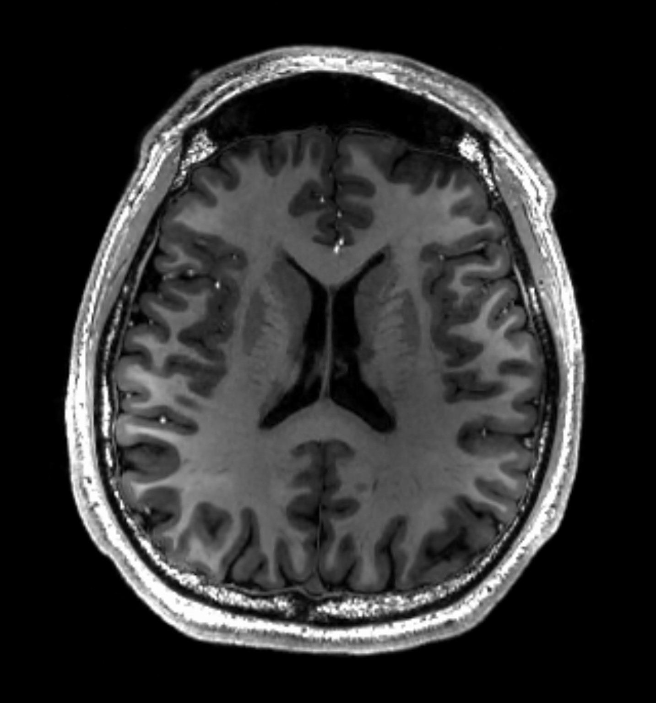

# Law of Large Numbers and Central Limit Theorem

Today we will:

* Introduce the Law of Large Numbers (LLN)
* We will use simulations to demonstrate the LLN
    + Simulations -> Math
    + Math -> Simulations
    + Then we will create a simulation where the LLN doesn't work

### Conceptual overview

This is to illustrate the law of large numbers using some example data.

* The law of large numbers describes what happens to the empirical average as it is taken over increasing sample sizes.

```{r, echo=TRUE}
# read in student names
# each student is a researcher
students = read.csv('../../unshared/students2023.csv')

# read in data
puf = readRDS('../datasets/nsduh/puf.rds')
# ever tried cigarettes indicator
triedCigs = puf$cigflag
# make it a Bernoulli random variable
triedCigs = ifelse(triedCigs=='yes', 1, 0)

ns = c(10, 50, 100, 200, 300, 400, 500)

for(n in ns){
  # Each person in the class is performing a study of smoking
  studies = lapply(students$First.Name, function(student) sample(triedCigs, size=n))
  names(studies) = students$First.Name
  
  # get the mean for each person's study
  studyMeans = sapply(studies, mean)
  # histogram of the study means
  hist(studyMeans, xlim=c(0,1), breaks=10, main=paste0('n=', n))
  abline(v=mean(triedCigs))
}
#hist(sqrt(n)*(studyMeans-mean(triedCigs)), xlim=c(0,1), breaks=10, main=paste0('n=', n))
```


## Law of Large Numbers overview

* The LLN is a tool we can use to say that the average of a sample is close to its expected value (and get's closer with larger sample sizes).
* I wouldn't consider an estimator that doesn't satisfy the LLN


### Simulations -> Math: illustrating the LLN with simulations


#### Initial simulation without convergence definition

* First, let's choose a distribution.
* Then, let's initialize empty vectors, `x` and `means`.
* For `n in 1:maxn`,
    + Draw a sample from our distribution and add it to `x`, `x<-c(x,<new random sample>)`.
    + Compute the mean of `x` and save it in another vector `means[n]<- mean(x)`.
* Plot the vector `means`.


```{r, LLN, echo=TRUE}
# distribution we're sampling from
p = mean(triedCigs)
RVfunc = function(n) rbinom(n, size=1, prob=p)
# x is the observed sample
x = c()
# this is the mean of the observed sample
means = c()
# maximum sample size to get to
maxn=5000

# for loop through samples
for(n in 1:maxn){
  xn = RVfunc(1)
  x = c(x, xn)
  means = c(means, mean(x))
  }


plot(1:maxn, means, type='l', xlab='', ylab='', ylim=c(0,1))
# what is this converging to?
abline(h=p, lty=2)
```

What do you notice about this plot?

Let's describe mathematically what we did.

* $X_i \sim$, for $n=1,2, \ldots$
* $\bar X_n = \frac{1}{n} \sum_{i=1}^n X_i$
* $\bar X_n \to$ what? What does this little arrow mean?


#### Convergence of random variables
**Definition:** $Y_n$ converges to $Y$ *in probability* if for all $\epsilon>0$, $\lim_{n\to\infty}\P(\lvert Y_n - Y \rvert \le \epsilon) = 1$ as $n\to\infty$.


**Definition:** $Y_n$ converges *almost surely* to $Y$ if $\P(\lim_{n\to \infty}\lvert Y_n - Y \rvert =0) = 1$ as $n\to\infty$.


### Math -> Simulations: adding convergence definition

How do we incorporate one of these convergence definitions into our simulations?

* Someone in the class give `epsilon>0`.
* For each `sim in 1:nsim`
    * Then, let's initialize empty vector, `x` and empty array `means=matrix(NA, nrow=nsim, ncol=maxn)`.
    * For `n in 1:maxn`,
        + Draw a sample from our distribution and add it to `x`, `x<-c(x,<new random sample>)`.
        + Compute the mean of `x` and save it in another vector `means[sim,n]<- mean(x)`.
* Use `means` to compute $\P(\lvert \bar X_n - \E X_i \rvert > \epsilon)$.
* Plot $\P(\lvert \bar X_n - \E X_i \rvert > \epsilon)$ as a function of `n`.


```{r, LLNconvergence, echo=TRUE, cache=TRUE}
epsilon = 0.02
nsim = 500
# distribution we're sampling from
p = mean(triedCigs)
RVfunc = function(n) rbinom(n, size=1, prob=p)
# maximum sample size to get to
maxn=10000
# this is the mean of the observed sample
meansout = matrix(NA, nrow=nsim, ncol=maxn)


for(sim in 1:nsim){
  cat(sim, '\t')
  # for loop through samples
  # x is the observed sample
  x = c()
  means = c()
  
  x = RVfunc(maxn)
  meansout[sim,] = cumsum(x)/1:maxn
  # for(n in 1:maxn){
  #   xn = RVfunc(1)
  #   x = c(x, xn)
  #   means = c(means, mean(x))
  # }
  # meansout[sim,] = means
}

P_XbarMinusp = colMeans(abs(meansout - p) < epsilon)

plot(1:maxn, P_XbarMinusp, type='l', xlab='', ylab='', ylim=c(0,1))


# plot(1:maxn, means, type='l', xlab='', ylab='')
# what is this converging to?
# abline(h=, lty=2)
```


### Formal definition of LLN

#### IID random variables

IID stands for independent and identically distributed.

For a sample $X_i, \ldots, X_n$:

* Independence means that their probability distributions factor
* Identical means $X_i \sim F_x$ (They all have the same distribution function).

#### Law of large numbers (Weak law)

* Weak LLN is about convergence in probability

**Theorem (Durrett, pg. 61):** Let $X_1, X_2, \ldots$, be iid random variables with $\E X_i = \mu$ and $\E \lvert X_i \rvert <\infty$.

If $S_n = X_1 + \ldots + X_n$, then as $n\to \infty$,
\[
S_n/n \to_p \mu.
\]

Better weak laws can allow some dependence among the observations and usually just require that $\E X_i^2 < \infty$. Check out google if you're interested.

The strong law is about almost sure convergence and doesn't require any further assumptions.

Intuition about LLN. What is the mean (expected value) of $S_n/n$? What is the variance of $S_n/n$?

* Mean
* Variance


#### How do we use theorems in research?

1. Demonstrate that assumptions of theorem are satisfied for our case.
2. Draw conclusion about our estimator.

What if assumptions are violated?

* The average may or may not converge
* There are more precise statements that are necessary and sufficient.


### Breaking the LLN: Cauchy distribution

* What is a Cauchy distribution (ratio of normal random variables; t RV on 1 DoF)
* The LLN can break if $\E \lvert X_i \rvert$ doesn't exist (is infinite). What does this mean?

It does not have any moments ($\E X_i = \infty$).

Let's use the simulations we wrote above to show that the mean of Cauchy random variables does not converge.

```{r, fig.height=4.5, fig.width=7.5, echo=TRUE}

epsilon = 0.01
nsim = 500
# Changed this to a Cauchy random variable!
RVfunc = function(n) rcauchy(n)
# maximum sample size to get to
maxn=5000
# this is the mean of the observed sample
meansout = matrix(NA, nrow=nsim, ncol=maxn)


for(sim in 1:nsim){
  cat(sim, '\t')
  # for loop through samples
  # x is the observed sample
  x = RVfunc(maxn)
  means = cumsum(x)/1:maxn
  meansout[sim,] = means
}

P_XbarMinusp = colMeans(abs(meansout)>epsilon)

plot(1:maxn, P_XbarMinusp, type='l', xlab='', ylab='', ylim=c(0,1))

plot(1:maxn, means, type='l', xlab='n', ylab='Xbar')
```


Note: we've already taken advantage of the LLN in the class. Does anyone know how?


## Central Limit Theorems (CLTs)

Today we'll consider another theorem about a different type of convergence for random variables.

The goals for today are:

1. Illustrate the CLT using Simulations -> Math
1. Illustrate the CLT using the Math -> Simulation approach with the Bernoulli distribution


### Preliminary: Normalizing sums of random variables

The CLT is about things that look like this:

* $X_i \sim F$ (IID arbitrary distribution) with $\E X_i = \mu$ and $\text{Var}(X_i) = \sigma^2$.
* $\bar X = n^{-1} \sum_{i=1}^n X_i$
* $Z = \sqrt{n} (\bar X - \mu)/\sigma$


### Preliminary: The normal distribution

](figures/normal_distribution.png)

Things about the normal distribution:

* Standard normal $Z\sim N(0,1)$ often denoted with a $Z$.
* PDF often denoted by $\phi(z)$.
* CDF often denoted by $\Phi(z)$.
* For $Y \sim N(\mu, \sigma^2)$, $(Y-\mu)/\sigma \sim N(0, 1)$  (often called Z-normalization).
* $\P(\lvert Z \rvert\le 1.96) = \Phi(1.96) - \Phi(-1.96) \approx 0.95$.
* $\P( Z \le 1.64) = \Phi(1.64) \approx 0.95$.


### Conceptual overview

This is to illustrate the CLT numbers using some example data.

```{r, echo=TRUE, fig.height=6, fig.width=12}
# read in student names
# each student is a researcher
students = read.csv('../../unshared/students2023.csv')

# read in data
puf = readRDS('../datasets/nsduh/puf.rds')
# ever tried cigarettes indicator
triedCigs = puf$cigflag
# make it a Bernoulli random variable
triedCigs = ifelse(triedCigs=='yes', 1, 0)

mu = mean(triedCigs)
sigma = sqrt(var(triedCigs))

ns = c(5, 10, 50, 100, 200, 300, 400, 500)

students = rep(students$First.Name, 100)

layout(matrix(1:8, nrow=2, byrow=TRUE))
for(n in ns){
  # Each person in the class is performing a study of smoking
  studies = lapply(students, function(student) sample(triedCigs, size=n))
  names(studies) = students
  
  # get the mean for each person's study
  studyMeans = sapply(studies, mean)
  stdMeans = sqrt(n)*(studyMeans - mu)/sigma
  # histogram of the study means
  hist(stdMeans, xlim = c(-3,3), breaks=10, main=paste0('n=', n))
}
```


### Preliminary: Convergence in distribution
**Definition:** A random variable $Y_n$ with distribution function $F_n(y)$ is said to *converge in distribution* to a limit $Y$ with distribution function $F(y)$ if, for all $y$ that are continuity points of $F$, $F_n(y) \to F(y)$.

I'll denote it $Y_n\to_D Y$.

* Let's unpack the notation $F_n(y) \to F(y)$. This means for any given $y$ and $\epsilon>0$ there exists $n$ such that,
\[
\lvert F_n(y) - F(y)\rvert < \epsilon.
\]

In other words, the distance between the distributions goes to zero as $n$ gets larger.


### The Central Limit Theorem
**The Central Limit Theorem (Durrett, pg. 124):** Let $X_1, X_2, \ldots$ be iid with $\E X_i = \mu$ and $\text{Var}(X_i) = \sigma^2 \in (0, \infty)$.

If $\bar X_n = n^{-1} \sum_{i=1}^n X_i$, then
\[
n^{1/2}(\bar X_n - \mu)/\sigma \to_D X,
\]
where $X \sim N(0,1)$.

Comments:

* We need the variance to be finite (stronger assumptions than LLN)

### The Lindeberg-Feller Theorem
<!-- **The Lindeberg-Feller Theorem (Durrett, pg. 124):**  For each $n$, let $X_{n,m}$, $1\le, m\le, n$, be independent random variables with $\E X_{n,m} = 0$. Suppose,  -->

<!-- 1. $\sum_{m=1}^n \E X_{m,n}^2 \to \sigma^2>0$ -->
<!-- 2. For all $\epsilon>0$, $\lim_{n\to\infty} \sum_{m=1}^n\E\left(\lvert X_{n,m} \rvert ; \lvert X_{n,m}\rvert>\epsilon \right) = 0$. -->

<!-- If $\bar X_n = n^{-1} \sum_{i=1}^n X_i$, then -->
<!-- \[ -->
<!-- n^{1/2}(\bar X_n - \mu)/\sigma \to_D X, -->
<!-- \] -->
<!-- where $X \sim N(0,1)$. -->

**The Lindeberg-Feller Theorem (Wikipedia):**
Let $X_i$ be independent random variables with $\E X_i = \mu _i$ and variances $\text{Var}(X_i) = \sigma^2_i \in (0, \infty)$.
Let $\sigma^2_n = \sum_{i=1}^n \sigma^2_i$.

If this sequence of random variables satisfies Lindeberg's condition
\[
\lim_{n\to\infty}\sigma^{-2}_n \sum_{i=1}^n \E\left\{(X_i-\mu_i)^2 I(\vert X_i - \mu_i\rvert>\epsilon \sigma_n) \right\} = 0,
\]
for all $\epsilon>0$.
Then
\[
Z_n = \sum_{i=1}^n (X_i-\mu_i)/\sigma_n \to_D Z,
\]
where $Z\sim N(0,1)$.

Comments:

* **Relaxes iid assumption to just independence!**
* CLTs are well studied, there are other ones for some what dependent variables.


* Will review CLT statement
* Will look at what it means for Bernoulli example and using simulations


### Example of CLT with Bernoulli distribution

* The Bernoulli is appealing because we can assess the CLT mathematically.
* Sum of Bernoulli RV is Binomial.
* Using the CLT, for samples $X_1, \ldots, X_n$, from this distribution the standardized mean is
\[
\sqrt{n}\frac{(\bar X_n -p)}{p(1-p)} \sim N(0,1) \text{ (approximately)}
\]
* $\P(\sqrt{n} (\bar X - p)/\sqrt{p(1-p)} \le z) = \P\left(n\bar X \le \left(np(1-p)\right)^{1/2}\times z + np \right) \to \P(Z\le z)$, where $Z\sim N(0,1)$

So how do we evaluate this:

* Pick a value for $p$ and.
* Choose a vector for  $n$ and $z$.
* Compare the CDFs by the sample size.

Note: We don't even need to run simulations because we can do it using the CDFs in R.

```{r binomCLT, echo=TRUE, fig.width=10}
ns = 1:5000
p = 0.01
z = seq(-2, 2, length.out=1000)

probDiffs = rep(NA, length(ns))
for(n in ns){
 probDiffs[n] = max(abs( pbinom(sqrt(n*p*(1-p))*z + n*p, size = n, prob=p) - pnorm(z)   )  )
}
plot(ns, probDiffs, xlab='Sample size', ylab='Distribution error', main='CLT for Bernoulli', type='l')
abline(h=0, lty=2)
```

### QQ-plot!


#### Binomial proportion: Another look using simulations

```{r binomialSimulation, echo=TRUE, fig.height=3.5, fig.width=12, eval=TRUE}
ns = seq(5, 100, by=10)
layout(matrix(1:10, ncol=5, byrow=TRUE))
p = 0.75
for(n in ns){
  means = replicate(10000,
                 # compute mean 1000 times
                 sqrt(n) * (mean(rbinom(n, 1, p))-p) / sqrt(p*(1-p))
                 )
  hist(means,main=paste('n =', n), probability = TRUE, ylab='', xlab='' )
  # draw standard normal density
  x = qnorm(ppoints(1000))
  points(x, dnorm(x), type='l')
}

layout(matrix(1:10, ncol=5, byrow=TRUE))
for(n in ns){
  means = replicate(10000,
                 # compute mean 1000 times
                 sqrt(n)*(mean(rbinom(n, 1, p))-p)/sqrt(p*(1-p))
                 )
  qqnorm(scale(means), main=paste('n =', n), ylab='Means quantiles', xlab='Normal quantiles' )
  abline(a=0, b=1)
}
```


<!-- ## Binomial proportion: Alcohol consumption example -->
<!-- * CLT implies that, for large $n$ -->
<!-- \[ -->
<!-- F_n(x) \approx F(x), -->
<!-- \] -->
<!-- where $F_n(x)$ is the distribution function for $\sqrt{n}\frac{(\bar X_n - p)}{p(1-p)}$ -->


### Comment about dependence in the CLT

For a bunch of RVs with zero mean and nonzero covariance
\[
\begin{aligned}
\text{Var}(n^{-1/2}\bar X_n) & = n^{-1}\text{Cov}(S_n, S_n) \\
& = \sum_{i,j}^n \text{Cov}(X_i, X_j) \\
& = n^{-1}\sum_{i=1}^n \text{Var}(X_i) + n^{-1}\sum_{i\ne j} \text{Cov}(X_j, X_k)\\
& = \text{Var}(X_i) + (n-1)\text{Cov}(X_j, X_k)\\
&\text{(if Var and Cov are the same for all RVs)} 
\end{aligned}
\]

Comments:

* The first term converges under CLT assumptions.
* The second term has $n(n-1)$ terms.
  + We need the covariance terms to get "small enough" for the CLT to work.
  + For example, by things that are "far away" having small covariance.

### Conclusions of CLT

* The CLT allows us to make approximate probability statements for things that can be expressed as sums.
* This is handy when we don't know the distribution of things.
* Some form of independence is necessary.


### Take home points of LLN and CLT

* LLN is about the convergence of the mean estimator to a constant.
* CLT is about the convergence of the mean estimator times $\sqrt{n}$ to a normal distribution.
* CLT is used a lot in statistics to make approximate probability statements.


* Questions on upcoming homework?
* 
* Lab will be the one for module 2 if we have time. If not, you can use it to practice concepts on your own.


### Example: HCP data set


{#id .class width=50% height=50%}

* Human Connectome Project data
* Study designed to understand how regions of the brain are interconnected
*

```{r TotalVol}
hcp = read.csv('../datasets/hcp/hcp.csv')
corr = cor(hcp$FS_Total_GM_Vol, hcp$FS_TotCort_GM_Vol, use = 'pairwise.complete.obs')
plot(hcp$FS_Total_GM_Vol, hcp$FS_TotCort_GM_Vol, xlab='Gray Matter Vol', ylab='Cortical GM Vol', main='Cortical GM Volume vs total GM vol')
legend('topleft', legend=paste('Cor =',  round(corr, 2) ))
abline(lm(FS_TotCort_GM_Vol ~ FS_Total_GM_Vol, data=hcp))


corr = cor(hcp$FS_SubCort_GM_Vol, hcp$FS_TotCort_GM_Vol, use = 'pairwise.complete.obs')
plot(hcp$FS_SubCort_GM_Vol, hcp$FS_TotCort_GM_Vol, xlab='Subcortical Vol', ylab='Cortical GM Vol', main='Cortical GM Volume vs Subcortical GM vol')
legend('topleft', legend=paste('Cor =',  round(corr, 2) ))
#abline(lm(FS_TotCort_GM_Vol ~ FS_Total_GM_Vol, data=hcp))
```


```{r PSQI}
hist(hcp$PSQI_Score)
corr= cor(hcp$PSQI_Score, hcp$FS_TotCort_GM_Vol, use = 'pairwise.complete.obs')
# compute correlation manually
PSQI_Score = hcp$PSQI_Score[!is.na(hcp$PSQI_Score) & !is.na(hcp$FS_TotCort_GM_Vol)]
TotCorGMVol = hcp$FS_TotCort_GM_Vol[!is.na(hcp$FS_TotCort_GM_Vol) & !is.na(hcp$PSQI_Score)]
corr
cov(PSQI_Score, TotCorGMVol)/sqrt(var(PSQI_Score)*var(TotCorGMVol))
sum( (PSQI_Score - mean(PSQI_Score)) *(TotCorGMVol - mean(TotCorGMVol)) ) /sqrt(sum( (PSQI_Score - mean(PSQI_Score))^2) * sum( (TotCorGMVol - mean(TotCorGMVol))^2))


plot(hcp$PSQI_Score, hcp$FS_TotCort_GM_Vol, xlab='PSQI scpre', ylab='Cortical GM Vol', main='Cortical GM Volume vs PSQI score')
legend('topleft', legend=paste('Cor =',  round(corr, 2) ))
abline(lm(FS_TotCort_GM_Vol ~ PSQI_Score, data=hcp))
```

### Simulated data

```{r, echo=TRUE}
set.seed(100)
# number of simulations per n and rho
nsim = 2
# sample sizes
ns = c(100)
# correlation
rhos = c(0.1)

resultsTab = expand.grid(n=ns, rho=rhos)
resultsTab$rhoBias = NA

# each column is a draw of x and y
for(rhoind in 1:length(rhos)){
  rho = rhos[rhoind]
  Sigma = matrix(c(1, rho, rho, 1), nrow=2)
  sqrtSigma = svd(Sigma)
  sqrtSigma = sqrtSigma$u %*% diag(sqrt(sqrtSigma$d))
  for(nind in 1:length(ns)){
    n = ns[nind]
    # NEED TO DO SOMETHING HERE
    # need a vector to store the correlation values in
    simresults = rep(NA, nsim)
    for(sim in 1:nsim){
      xy = tcrossprod(matrix(rnorm(n*2), ncol=2), sqrtSigma)
      # YOU NEED TO EDIT THE CODE HERE
      simresults[sim] = cor(xy[,1], xy[,2])
    }
    
    # AND SOMETHING ELSE HERE (compute bias and assign in resultsTab)
    
  }
  
}
```


